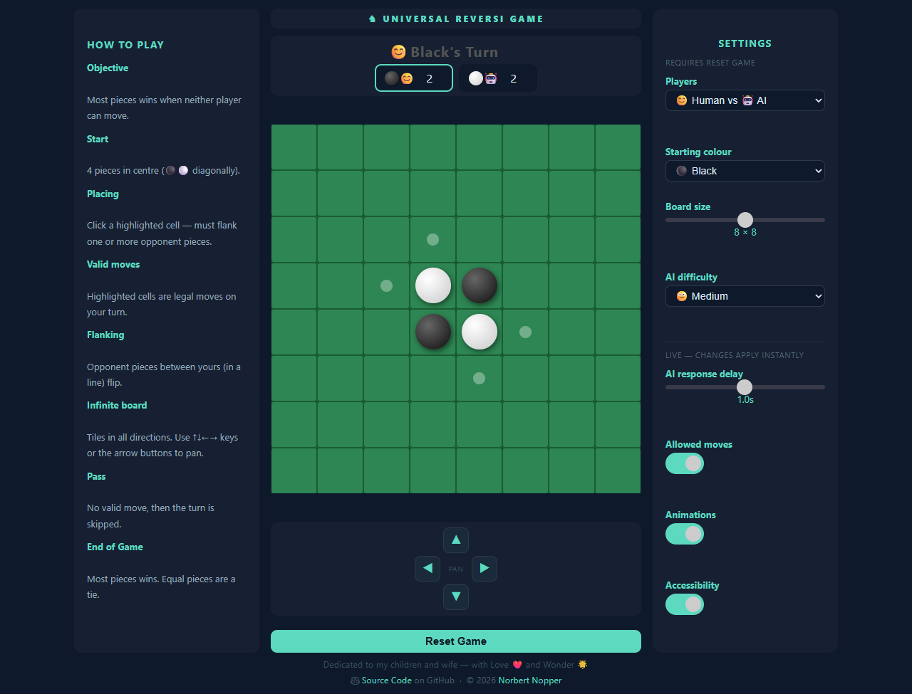
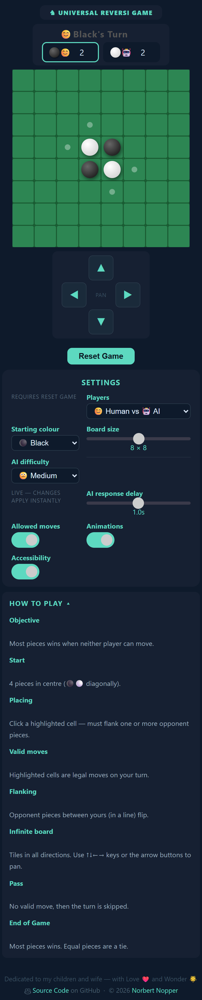

# ♞ Universal Reversi Game

💡 by [Norbert Nopper](https://nopper.tv) - an implementation of Reversi with an infinite playing field.

Dedicated to my children and wife — with Love ❤️ and Wonder 🌟

## Digital Devices

### Desktop

#### Default Mode

#### Accessibility Mode

### Mobile

#### Default And Accessibility Mode

 

## Features

- **Infinite board** — the board tiles infinitely in all directions; pan freely with ↑↓←→ or the on-screen d-pad
- **Four player modes**

  | Mode | Description |
  |---|---|
  | 😊 Human vs 😊 Human | Two human players |
  | 😊 Human vs 🤖 AI | Human plays Black, AI plays White |
  | 🤖 AI vs 😊 Human | AI plays Black, Human plays White |
  | 🤖 AI vs 🤖 AI | AI plays both sides |
- **Starting colour** — choose whether ⚫ Black or ⚪ White makes the first move
- **Configurable board size** — 6×6, 8×8, or 10×10 (default 8×8)
- **Five AI difficulty levels**
  | Level | Strategy |
  |---|---|
  | 😇 Very Easy | Random move |
  | 😊 Easy | Greedy — maximise immediate flips |
  | 😐 Medium | Minimax with α-β pruning, depth 1 |
  | ☹️ Hard | Minimax with α-β pruning, depth 2 |
  | 😈 Extra Hard | Minimax with α-β pruning, depth 3 |
- **AI response delay** — slider from 0.02 s to 2.0 s so you can follow the AI's moves; valid move hints are shown while the AI is thinking
- **Allowed moves** — toggle the on-board hint dots that mark legal moves on your turn (on by default)
- **Animations** — piece pop-in and flip effects (on by default)
- **Accessibility mode** — high-contrast ●/○ symbols replace gradient pieces for colourblind users
- **Mobile-friendly** — responsive layout optimised for phones and tablets

> All settings take effect after pressing **Reset Game**.

## How to Play

### Online

🌍 **[nopper.tv/ur](https://nopper.tv/ur/)**

### Local

Download or clone the repository and open `index.html` directly in any modern browser — no server, no build step, no dependencies required.

## Game Rules

Standard Reversi rules apply: place a piece to flank one or more opponent pieces in any of the 8 directions; flanked pieces flip to your colour. The player with the most pieces when neither side can move wins.

Because the board is infinite, pieces and flanking lines can extend freely in any direction across the ever-expanding playing field, opening up strategies impossible on a bounded board.

## References

- **Original Reversi** — invented by [Lewis Waterman and John W. Mollett](https://en.wikipedia.org/wiki/Reversi) (1883)
- **Implementation** — using different AI models 🤖

---

© 2026 [Norbert Nopper](https://nopper.tv)
