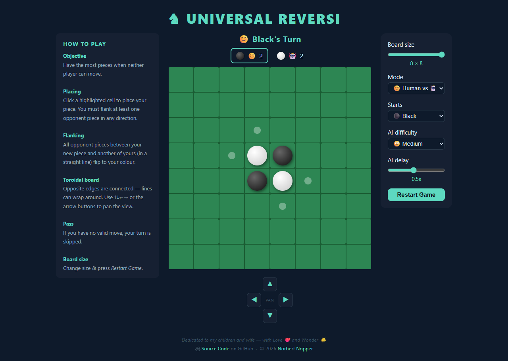
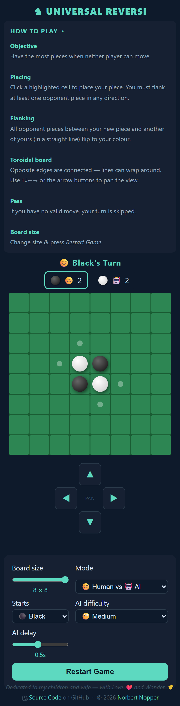

# ♞ Universal Reversi

*💡 by [Norbert Nopper](https://nopper.tv)* - an implementation of Reversi with an infinite playing field.

*Dedicated to my children and wife — with Love ❤️ and Wonder 🌟*

## Digital Devices

### Desktop

### Mobile

## Features

- **Configurable board size** — 4×4, 6×6, or 8×8 (default 8×8)
- **Infinite board** — opposite edges connect seamlessly; no cell is an edge, no cell is special
- **Four game modes** — 😊 Human vs 😊 Human · 😊 Human vs 🤖 AI · 🤖 AI vs 😊 Human · 🤖 AI vs 🤖 AI
- **Who starts** — choose whether ⚫ Black or ⚪ White makes the first move
- **Five AI difficulty levels**
  | Level | Strategy |
  |---|---|
  | 😇 Very Easy | Random move |
  | 😊 Easy | Greedy — maximise immediate flips |
  | 😐 Medium | Minimax with α-β pruning, depth 1 |
  | ☹️ Hard | Minimax with α-β pruning, depth 2 |
  | 😈 Extra Hard | Minimax with α-β pruning, depth 3 |
- **AI reaction delay** — slider from 0.1 to 1.0 seconds so you can follow the AI's moves; valid move hints are shown while the AI is thinking
- **Pan the view** — use ↑↓←→ or the on-screen d-pad to scroll around the infinite board
- **Animations** — piece pop-in and flip effects
- **Mobile-friendly** — responsive layout optimised for phones and tablets

## How to Play

### Online

🌍 **[nopper.tv/ur](https://nopper.tv/ur/)**

### Local

Download or clone the repository and open `index.html` directly in any modern browser — no server, no build step, no dependencies required.

## Game Rules

Standard Reversi rules apply: place a piece to flank one or more opponent pieces in any of the 8 directions; flanked pieces flip to your colour. The player with the most pieces when neither side can move wins.

Because the board is infinite, flanking lines can cross any edge and wrap around, opening up strategies impossible on a bounded board.

## References

- **Original Reversi** — invented by [Lewis Waterman and John W. Mollett](https://en.wikipedia.org/wiki/Reversi) (1883)
- **Implementation** — using different AI models 🤖

---

© 2026 [Norbert Nopper](https://nopper.tv)
